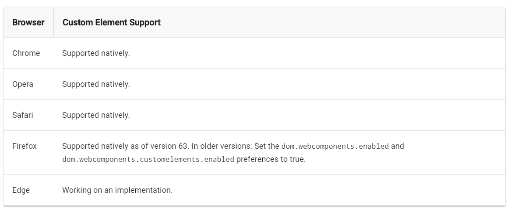

# NgCeibaElems

This project was generated with [Angular CLI](https://github.com/angular/angular-cli) version 8.3.22.

# Serve

Try components in development mode (Compiler set to AOT to handle inheritance dependency injection)

## Build

Run `npm run build` to build the project.

This command does:

* Compile angular app with AOT compiler, files-non-hashed and production strategies
* Create a new folder called "unified-script"
* Create bundle of es2015 scripts and copy in new folder
* Copy es5 scripts in new folder
* Copy webcomponents polyfills to new folder
* Create an index.html with a base template in `src/unified-script.html`

## Run

Run `npm start` to run the static app.

This command does:

* navigate to dist/unified-script
* serve static app in `http://localhost:5000/`

## Playground

Use this javascript code in devTools console
```javascript
// get components DOM objects

const webComp = document.querySelector('custom-web-component');
const formComp = document.querySelector('custom-form-component');

// Pass data to component using React "useState" concept (INPUT):
webComp.setState({message: 'hi there!'});

// Read properties from state
webComp.getState('message');

// listen event from component with custom event API (OUTPUT):
formComp.addEventListener('form-filled', (event) => console.log(event.detail))
```

## Browser support

According to the official Angular elements Docs. These the current supported browsers:



## Polyfills and limitations

To give support for Edge and IE11 we added `@webcomponents/webcomponentsjs` polyfills. It's a bundle to enable:

* Custom-elements
* Shadow DOM
* Shadow CSS

Although these polyfills allows you to render a web component, Shadow DOM and Shadow CSS does't work correctly
and some of its scoped styles will be applied globally. You have to change styles-creation strategy.
see: [shadow css example](https://github.com/webcomponents/polyfills/tree/master/packages/shadycss#example)

## Consider

* Deleted `AppComponent` (We don't need to bootstrap a root component).
* Deleted `AppRoutingModule` (We don't use routes in web components).
* Avoid using style-frameworks. Write your own styles or import just what you really need from style-frameworks (`e.g. Sass @import`).
* Don't use src/styles to define your component styles (each component should have its own styles).
* All components should have shadow DOM encapsulation to keep component styles scoped.
* For performance reasons, you should reduce the change detection control for angular zone and handle it manually on each component (Use `NgElementBase`).

## Recommended readings

* [WebComponents - Introduction](https://www.webcomponents.org/introduction)
* [Why you should care about Angular Elements](https://medium.com/selfbits/why-you-should-care-about-angular-elements-fbc8dba7aad)
* [ViewEncapsulations in Angular Component](https://medium.com/@hardikpthv/viewencapsulations-in-angular-component-ce48fedcf94c)
* [Understanding the Magic Behind Angular Elements](https://netbasal.com/understanding-the-magic-behind-angular-elements-8e6804f32e9f)
